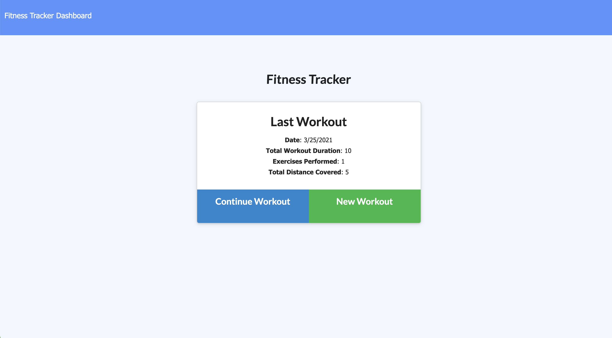
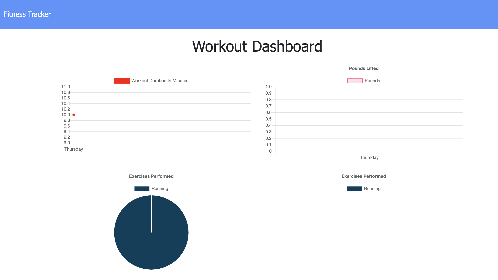

# fitnessTrackerHW17

## Table of Contents: 
[Project Description](#Project-Description)  
[Usage Information](#Usage-Information)   
[Questions and Contact Information](#Questions-and-Contact-Information)  
[Screenshots](#Screenshots)  
[Heroku](#Heroku)  

## Project Description 
This homework uses heroku and mongo db to store exercise logs that is inputted by the user. The user can keep track of cardio and resistance workouts and that they do, and then can be shown historical data visualization of their workouts. 

## Usage Information 
Go to the heroku link below to use this application 

### Questions and Contact Information 
Github: github.com/Alexgoldman98  
Github username: Alexgoldman98   
Email address: alexgoldman98@gmail.com  
Any Questions should be directed to me using the above contact information.

### Screenshots

### Heroku
https://fitnesstrackeralexg.herokuapp.com/